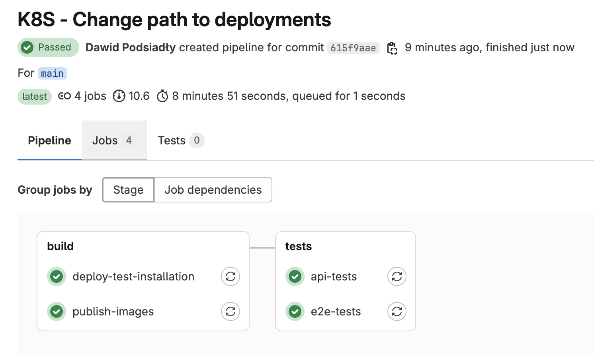

## About The Project:
This project demonstrates a fully automated process for deploying an application from a branch on [GitLab](https://gitlab.com/) 🚀 to a [Kubernetes](https://kubernetes.io/) environment on [Google Kubernetes Engine (GKE)](https://console.cloud.google.com/) 🛠️. The application is then automatically tested using End-to-End (E2E) and API tests, executed directly within the GitLab CI/CD pipeline.

The application is tested by:
- 16 **End-to-End (E2E) tests** using [Playwright](https://playwright.dev/) 🎬 to validate the user interface and overall application flow.
- 46 **API tests** using [Supertest](https://www.npmjs.com/package/supertest) + [Jest](https://jestjs.io/) 🧪 to ensure backend endpoints function correctly.

The CI/CD pipeline automates the entire process, from building and deploying the application on Kubernetes to executing the tests.

## Technologies:
### App:
- React.js ⚛️
- Node.js 🟩
- MongoDB 🍃
- Express 🚀

### Deployment:
- Google Kubernetes Engine (GKE) 🌐 – Kubernetes cluster hosting
- GitLab CI/CD 🔄 – automation of build and deployment processes
- Kubernetes (K8s) 🔧 – container management

### Tests:
- Playwright (E2E) 🎬
- Supertest + Jest (API) 🧪

## How to Setup:
Before running the project, you need to configure it for your environment. This setup ensures that your Google Cloud, Kubernetes, and GitLab CI/CD configurations are correctly adapted to your infrastructure. Follow the steps below to set up the project.

### 1. Clone the repository:
    git clone https://github.com/dawidpodsiadly/app-testing.git
### 2. Configure Google Cloud:
- Log in to Google Cloud:
    ```
    gcloud auth login
    ```
- Create a project on Google Cloud:
    ```
    gcloud projects create PROJECT_ID --name="PROJECT_NAME"
    gcloud config set project PROJECT_ID
    ```
- Create your cluster on GKE:
    ```
    gcloud container clusters create CLUSTER_NAME --region REGION_NAME
    ```
- Enable the Container Registry API:
    ```
    gcloud services enable containerregistry.googleapis.com
    ```
- Generate a static external IP on Google Cloud:
    ```
    gcloud compute addresses create your-ip-name --region your-region
    ```
- Obtain a key for a service account with permissions to push images to Google Container Registry (GCR) via the Google Cloud Console:
    - Go to **IAM & Admin → Service Accounts** and create a new service account with appropriate permissions for GCR access.
    - Assign roles like `Storage Object Admin` to the service account, which will allow it to push images to the GCR.

### 3. Configure GitLab:
- In your GitLab project, create an environment variable `GCLOUD_SERVICE_KEY` to securely store your service account key:
    - Navigate to **Settings → CI/CD → Variables** and add a new variable with the key `GCLOUD_SERVICE_KEY` and the value being your service account key.
- Configure GitLab CI/CD pipeline variables in your `.gitlab-ci.yml` file:
    - Set the following variables in the file `GCP_PROJECT_ID`, `GCP_REGION`, `GCP_CLUSTER_NAME`.

### 4. Update Kubernetes Deployment Configs:
- Update the project ID in the deployment YAML files:
    - In `/app/_deployment/api/deployment.yaml` and `/app/_deployment/gui/deployment.yaml`, replace the project ID with your actual `PROJECT_ID`.

### 5. Update baseUrl for API and E2E tests:
- Update the `baseUrl` for API tests:
    - In `tests/api/src/services/path-service.ts` to `YOUR_APP_STATIC_IP/api`.
- Update the `baseUrl` for E2E tests:
    - In `tests/e2e/config.ts` to `YOUR_APP_STATIC_IP`.

### 6. Configure MongoDB:
- Configure the [MongoDB](https://www.mongodb.com/) connection in `app/api/server.js`.

## How to Run:

Once the setup is completed, all you have to do is open GitLab and run:

1. To build and deploy the app, trigger the pipeline with the variable `DEPLOY_TEST_INSTALLATION=true`. This will automatically create the test users for E2E and API tests.

2. To run API tests, trigger the pipeline with the variable `RUN_API_TESTS=true`.

3. To run E2E tests, trigger the pipeline with the variable `RUN_E2E_TESTS=true`.


